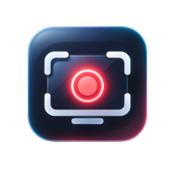

<h1 align="center">Arssyut</h1>

<strong>Enhanced Screen Recorder for Windows</strong>

Capture your screen. Stay in the flow.

<a href="https://masarray.github.io/arssyut/">Website</a> · <a href="https://masarray.github.io/arssyut/download/">Downloads</a> · <a href="https://github.com/masarray/arssyut/releases">GitHub Releases</a> · <a href="https://github.com/masarray/arssyut/issues">Support</a>

 

Arssyut is a focused Windows screen recorder for tutorials, software demos, walkthroughs, and everyday captures. Choose what to record, start capturing, and save an MP4—without a crowded workspace.

> [!IMPORTANT]
> **Download status:** Windows preview **[v0.1.0-rc.1](https://github.com/masarray/arssyut/releases/tag/v0.1.0-rc.1)** is published with real **Setup EXE** and **portable single EXE** assets. It is a prerelease, not a stable release. **System audio and microphone recording are implemented**, including the recording mixer. **Webcam recording is not yet implemented.**

## What can Arssyut do?

| Feature | Current status |
| --- | --- |
| Record an entire display | Available |
| Capture a window or selected region | Available |
| Save and open MP4 recordings | Available |
| Mouse click highlighting and shortcut visualization | Available |
| Zoom/presentation controls | Available, subject to capture mode |
| Remember user preferences | Available |
| System audio and microphone recording | Implemented in the audio-enabled Windows preview |
| Audio mixer, volume, mute and stereo level meters | Implemented |
| Webcam recording and preview | **Not implemented yet** |
| Game capture | Not yet available as a finished feature |

The application you launch is **Arssyut.UI.exe**, the compact Windows GUI. It does not require opening a Command Prompt.

## Download & get started

1. Visit the **[download page](https://masarray.github.io/arssyut/download/)** or the official **[v0.1.0-rc.1 release](https://github.com/masarray/arssyut/releases/tag/v0.1.0-rc.1)**.
2. Choose **[Setup EXE](https://github.com/masarray/arssyut/releases/download/v0.1.0-rc.1/Arssyut-Setup-0.1.0-rc.1-win-x64.exe)** to install, or **[Portable EXE](https://github.com/masarray/arssyut/releases/download/v0.1.0-rc.1/Arssyut-0.1.0-rc.1-portable-win-x64.exe)** to run standalone without extracting a ZIP.
3. Launch Arssyut, select **Display**, **Window** or **Region**, enable **System audio** and/or **Microphone** as needed, and press **Start**.
4. Click **Stop** to finalize the MP4, then choose **Open** or **Folder** to review it.

These links identify the published preview. The website's download buttons resolve the **latest published GitHub Release assets dynamically**, so they should not be hardcoded to this preview version.

### Audio and webcam

**System audio and microphone recording are implemented.** The Windows audio-enabled recorder supports source toggles, recorded gain/mute controls, stereo input meters, and device selection. The earlier video-only CI artifact is only a regression/reference build; **do not distribute it as the audio-capable public application**.

**Webcam recording and its live preview have not been implemented.** The webcam panel may appear in the GUI as a placeholder, but it is not a finished recording feature.

## Questions and support

**Does it work on Windows 10 and 11?** Arssyut targets Windows x64. Hardware capabilities and Windows capture support can affect device compatibility.

**Do I need to install it?** No. The published Windows **portable .exe** can launch directly. The **Setup .exe** installs Start-menu shortcuts instead.

**Where are bugs reported?** Open a [GitHub Issue](https://github.com/masarray/arssyut/issues) and include your Windows version, capture mode, reproduction steps, and relevant diagnostics.

## For contributors and technical readers

Arssyut combines an Avalonia Windows interface with a native C++ capture/processing engine. Development emphasizes bounded real-time work, GPU-based presentation, explicit A/V clock ownership, and regression testing.

| Resource | Description |
| --- | --- |
| [Architecture](docs/ARCHITECTURE.md) | Capture, graphics, input, audio and encoding design |
| [Engineering roadmap](docs/ROADMAP.md) | Planned stages and acceptance gates |
| [Development handoff](docs/CURRENT_HANDOFF.md) | Current technical status and constraints |
| [Build / packaging](packaging/windows/README.md) | Windows portable and installer candidate workflows |
| [Third-party notices](docs/P6UI_THIRD_PARTY_NOTICES.md) | Dependency attribution and notices |

To run the native regression suite on a compatible Windows development machine:

<pre><code>cmake --preset windows-x64
cmake --build --preset windows-release --parallel
ctest --preset windows-release</code></pre>

The video-only CI package remains a regression reference, **not** the public audio-enabled application. Keep future installer and portable release assets sourced from the same verified audio-enabled binary.

### Branding

The official product identity lives in [assets/favicon/](assets/favicon). The Windows executable, installer icon, website favicon, and product image reuse that source.

### License and redistribution

This repository currently does not contain a root software license file. Public access to source does not by itself grant reuse or redistribution rights. Third-party components have separate licenses and notices. A software license should be explicitly selected before positioning the repository as an open-source release.
